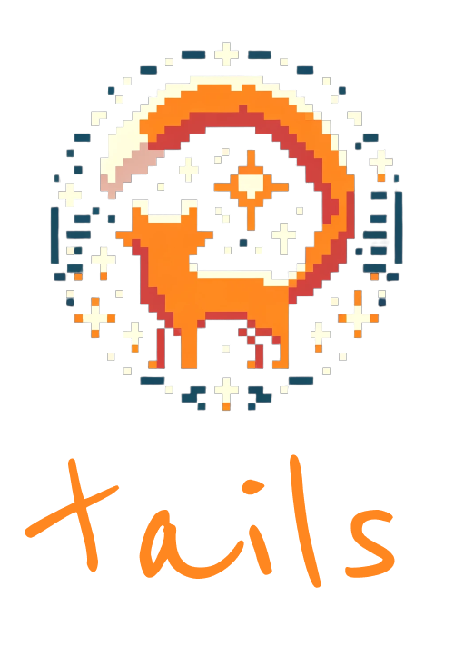
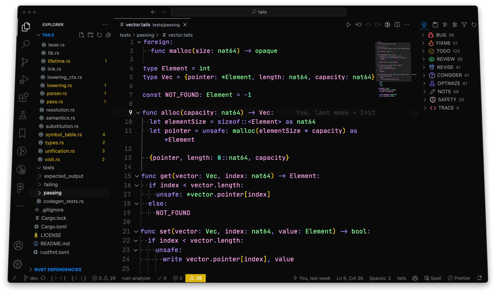
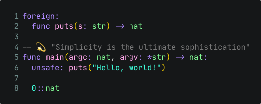

<div align="center">
  

  

  <p>An experimental functional systems programming language,<br />written in Rust, and powered by <a href="https://en.wikipedia.org/wiki/LLVM">LLVM</a> as a backend.</p>
</div>
<br />

🎯 **Goal:** The intent is to create a programming language that balances simplicity and performance, focusing on functional programming paradigms and compile-time safety mechanisms. The language aims to facilitate explicit tracking of side effects and embrace a predictable coding environment. See the [principles](#principles) section for more information.

## Features

* Python-like, concise syntax (adhering to the [off-side rule](https://en.wikipedia.org/wiki/Off-side_rule))
* Functional programming paradigm
* Strong, static type system
* First-class functions
* Pattern matching
* Powerful type inference, based on [Hindley-Milner type system](https://en.wikipedia.org/wiki/Hindley%E2%80%93Milner_type_system)
* [Parametric polymorphism via generics](https://en.wikipedia.org/wiki/Parametric_polymorphism)
* [Structural typing](https://en.wikipedia.org/wiki/Structural_type_system)
* [Closures](https://en.wikipedia.org/wiki/Closure_(computer_programming))

## Principles

* ✨ **Simplicity**: The language should be easy to learn but powerful enough for complex tasks. A simple syntax helps lower the barrier to entry. <br /><br />
* 📐 **Consistency & orthogonality**: Stick to one way of doing things. The language should use a few basic constructs that can be combined in many ways. This makes it easier to learn and use.<br /><br />
* 🔮 **Predictable, explicit, and deterministic semantics**: The type system should be straightforward and avoid surprises. No guessing games—you should always know what the code is doing.<br /><br />
* ❕ **Opinionated**: Make the language so there's a 'right way' to do things. This ensures everyone writes code that looks and works similarly, making it easier to understand and collaborate.<br /><br />
* 🙅🏻‍♂️ **No meta-programming or reflection**: Avoid features like meta-programming and reflection. They're often misused and make the language harder to learn and less consistent.<br /><br />
* ⚡ **Compile-time emphasis**: Do most heavy lifting, like error checking and memory management, when the code is compiled. This makes the executables faster and more reliable.<br /><br />
* ⛓️ **Functional paradigm**: Use functional programming to simplify code and reduce errors. It minimizes side effects and makes the code easier to reason about.

## Hello world example



> The `foreign` keyword lets you include functions and variables from other programming languages. You can put multiple such items in a foreign block to keep your code neat.

> The `unsafe` keyword is used for actions that have potential risks, like calling foreign functions or using pointers. This is much like Rust's `unsafe` keyword and helps you be explicit about the risky parts of your code.

> `nat` is a type that stands for unsigned integers, which are 32-bit by default. You can also use variations like `nat8`, `nat16`, and `nat64` for different bit sizes.

> The compiler doesn't automatically coerce types, so you can use `0::nat` to specify a literal's type. This is handy when the type you want doesn't match the compiler's default 32-bit numeric type.

## Building and running

### Prerequisites

* [Rust](https://www.rust-lang.org/tools/install)
* [LLVM 15](https://llvm.org/docs/GettingStarted.html)

### Building

```bash
cargo build
```

### Running tests

```bash
cargo test
```

<br />

<hr />
<div align="center">
  <i>
    Please feel free to reach out to me on <a href="https://www.linkedin.com/in/yurixander/">LinkedIn</a> for business inquiries.<br />
    Images generated with DALL·E 3, and edited with Figma.<br />
    &copy; 2023 Yurixander Ricardo<br /><br />
    
  </i>
</div>
